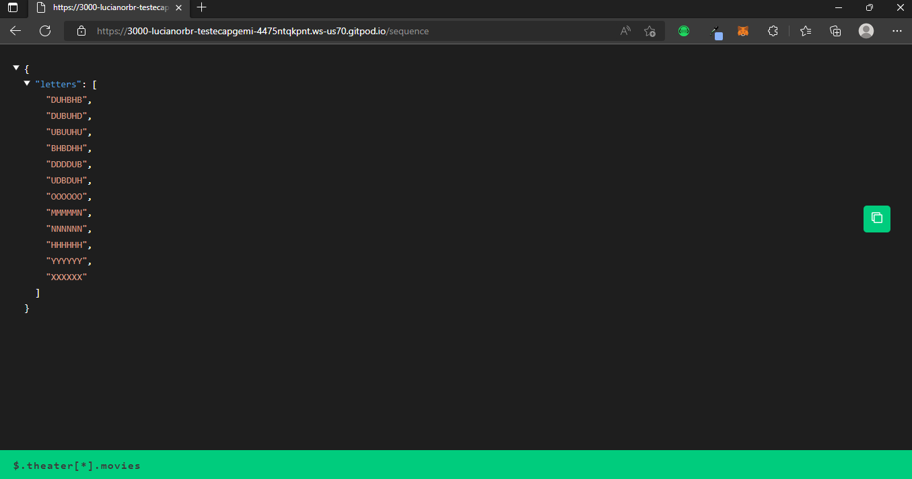
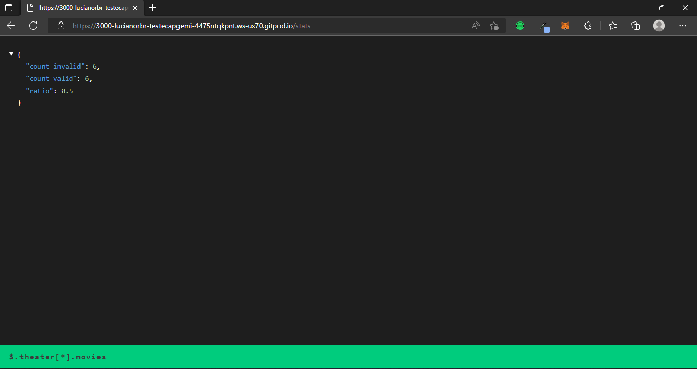
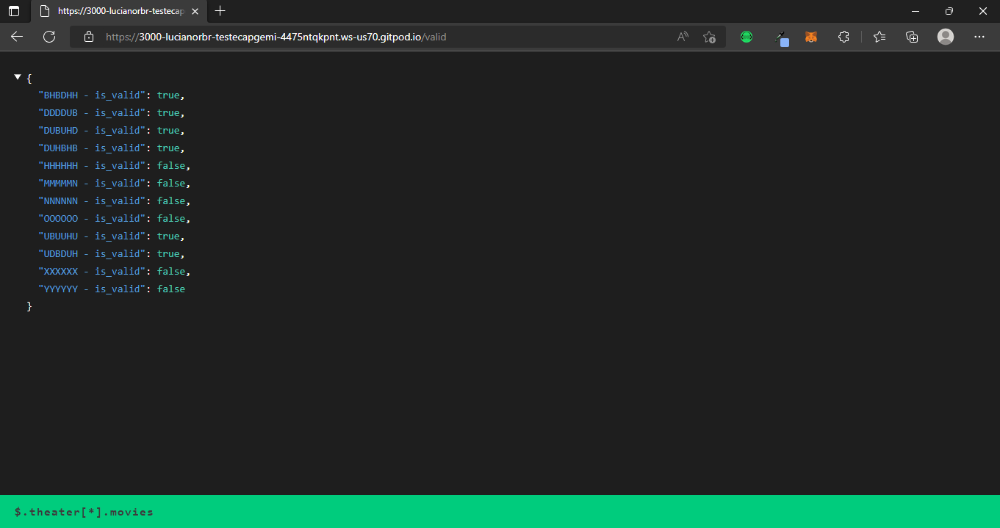

<h1 align="center">
O projeto consiste em desenvolver uma API REST em Go.
</h1>

## Autor

[Luciano Ribeiro](https://github.com/lucianorbr)

## Tecnologias

- [x] Go
- [x] Docker

## Frameworks
- [x] Fiber


## O Projeto
- Fui contratado para desenvolver um projeto em Go, Java, Python ou Javascript (NodeJS),
  que vai identificar se uma sequência de letras é válida. 


- Você saberá se uma sequência é válida, se encontrar 2 ou mais sequências de quatro
  letras iguais em qualquer direção, horizontal, vertical ou nas diagonais.
   As letras da String só podem ser: (B, U, D, H)


<p>-> /sequence
{
"letters": ["DUHBHB", "DUBUHD", "UBUUHU", "BHBDHH", " DDDDUB", "UDBDUH"]
} </p> 

<p>A API deve retornar um json com "is_valid": boolean. Caso você identifique uma sequência
válida, deve ser true, caso identifique uma sequência inválida, deve ser false, como no
exemplo abaixo:</p>

<p>HTTP 200</p>

{"is_valid": true}

## Nível 1:
Desenvolva uma API que esteja de acordo com os requisitos propostos acima, que seja capaz
de validar uma sequência de letras válidas.


## Nível 2:
<p>
Use um banco de dados de sua preferência para armazenar as sequencias verificadas pela API. 
Esse banco deve garantir a unicidade, ou seja, apenas 1 registro por sequência. 
Disponibilizar um outro endpoint "/stats" que responde um HTTP GET. A resposta deve ser um 
Json que retorna as estatísticas de verificações de sequências, onde deve informar a 
quantidade de sequências válidas, quantidade de sequências inválidas, e a proporção de 
sequências válidas em relação ao total. Segue exemplo da resposta:
</p>

<p>
{"count_valid": 40, "count_invalid": 60: "ratio": 0.4} 
</p>

## Nível 3:
<p>
Construir um Docker composse para executar a API, para possibilitar a execução em qualquer 
ambiente. 
</p>

# Como executar o projeto

## Pré-requisitos

Antes de começar, você vai precisar ter instalado em sua máquina as seguintes ferramentas:
[Git](https://git-scm.com), [Docker](https://www.docker.com/).

## Rodando a aplicação

```bash
# Clone este repositório
$ git clone < https://github.com/lucianorbr/teste_Capgemini

# Acesse a pasta do projeto no terminal/cmd
$ cd teste_Capgemini

# Execute o comando abaixo para subir a aplicação
docker build . -t 'nome da image'

# Execute o comando abaixo para subir a aplicação
docker run -p 3000:3000 'nome da image'

# O servidor inciará na porta:3000 - acesse <http://localhost:3000>
```

## Sobre a aplicação


A aplicação foi desenvolvida em Go, utilizando o framework Fiber, e o banco de dados foi utilizado um arquivo .go nomeado de letters.go.

## Endpoints
- GET /sequence - Retorna um JSON com a sequência de letras.



- GET /stats - Retorna um JSON que retorna as estatísticas de verificações de sequências, onde deve informar a 
quantidade de sequências válidas, quantidade de sequências inválidas, e a proporção de 
sequências válidas em relação ao total.



- GET /valid - Retorna um JSON com toda a sequência de letras válidas armazenadas no bando de dados letters.go e informa se a sequência é válida ou não.




